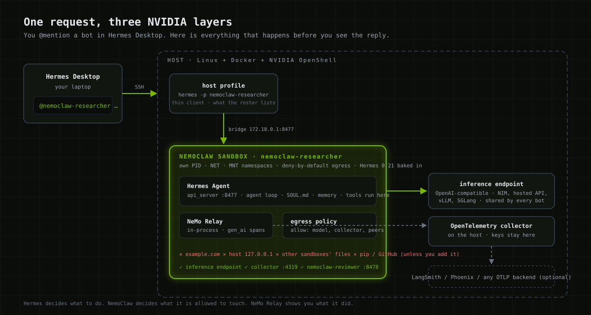
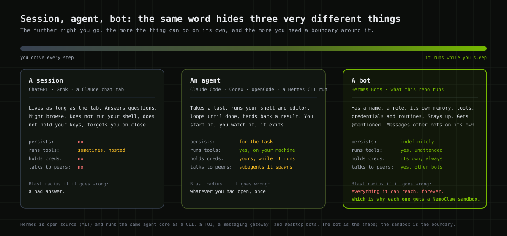
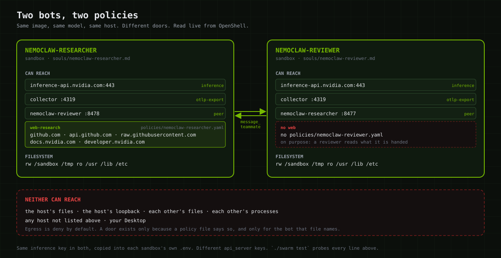
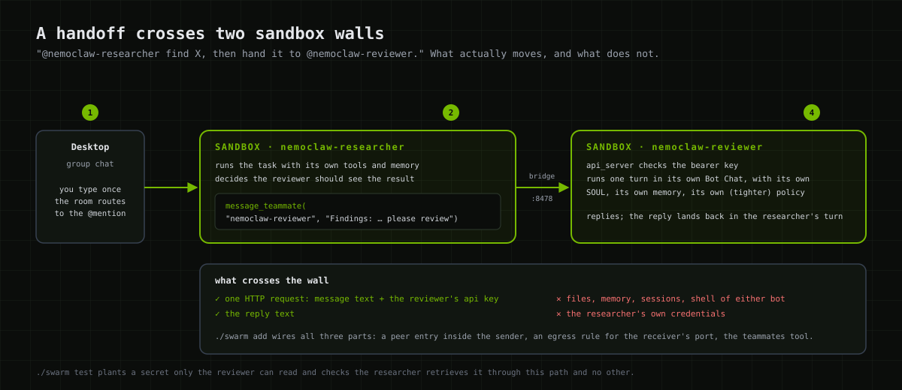

<p align="center">
  
</p>

# NemoClaw bots: Hermes agents you can leave running

This is a team of [Hermes](https://github.com/NousResearch/hermes-agent) bots on
one Linux host. Each bot lives in its own [NVIDIA OpenShell](https://github.com/NVIDIA/OpenShell)
sandbox managed by [NemoClaw](https://github.com/NVIDIA/NemoClaw). Each one is
traced by [NeMo Relay](https://docs.nvidia.com/nemo/relay/). You talk to them
from Hermes Desktop like coworkers in a group chat:

> @nemoclaw-researcher what changed in Hermes 0.21 for bot mode? Hand it to
> @nemoclaw-reviewer for a security read.

One command builds it. The same command brings it back after a reboot.

```
$ ./swarm up
▸ preflight              18 passed, 0 failed
▸ image                  hermes-bot:v2026.8.31 present
▸ tracing collector      swarm-otel running on 172.18.0.1:4319
▸ bot nemoclaw-researcher   sandbox Ready · Hermes v0.21.0 · api :8477 · relay on
▸ bot nemoclaw-reviewer     sandbox Ready · Hermes v0.21.0 · api :8478 · relay on
▸ mesh                   2 bots, 2 directed links
▸ status                 11 ok, 0 failed
```

## Why a bot is not just an agent

The word "agent" now covers three things that behave nothing alike. It's worth
being precise, because the third one changes what you have to build around it.

<p align="center">
  
</p>

A **session** is a chat tab: ChatGPT, Grok, a Claude conversation. It answers
you and forgets you.

An **agent** takes a task and runs with it. Claude Code, Codex, OpenCode, a
Hermes CLI run. It has your shell and your editor for as long as the task lasts,
then it exits. You started it. You're watching.

A **bot** is what you get when an agent stops exiting. Hermes 0.21 ships this as
Bot Mode: a bot has a name, a role, its own memory, its own credentials, tools,
scheduled routines, and a canonical chat that persists. Other bots can message
it. It runs while you sleep.

That last sentence is why this repo exists. A session can give you a wrong
answer. An agent can break what you had open. A bot with your shell, your keys,
and network access, running unattended and taking instructions from other bots,
has a blast radius of everything it can reach, for as long as it runs. A Hermes
*profile* keeps two bots from reading each other's config. It does not keep a
bot out of your home directory.

So each bot here runs in a NemoClaw sandbox, and the boundary is real: its own
PID, network, and mount namespaces, a filesystem it owns, egress denied unless a
policy says otherwise. Here are the two default bots, read live from OpenShell:

<p align="center">
  
</p>

The researcher can reach the model, the collector, its teammate, and a short
list of documentation sites. The reviewer can reach the model, the collector,
and its teammate. That difference is one file, `policies/nemoclaw-researcher.yaml`,
and the reviewer not having one. Neither bot can reach your laptop, the host's
loopback, or the other's files.

I don't want you to take that on faith. `./swarm test` runs 50 live checks,
including reading `/proc/self/ns/pid` from inside each sandbox to prove the
namespaces differ, asking a bot for `hostname` to prove its tools run inside,
and planting a secret only one bot can read to prove the handoff path is the
only path.

## The stack, in one breath

**Hermes** decides what to do. **NemoClaw** decides what it's allowed to touch.
**NeMo Relay** shows you what it did.

| | Layer | What you get |
|---|---|---|
|  | the bot | open source (MIT) agent core; Bot Mode gives it a name, memory, a roster, and `@mention` routing in Desktop |
|  | the boundary | one sandbox per bot; kernel namespaces; deny-by-default egress with hot-reloadable YAML policy; the inference key never leaves the sandbox's own `.env` |
|  | the record | ships inside Hermes; OpenTelemetry GenAI spans per turn, tool call, and model call, to a collector you control |

## Ten minutes to a working swarm

Two ways to run it. Same command, same bots, same tests.

| | Where the bots run | Good for |
|---|---|---|
| **Local** | your Mac or Linux box, sandboxed, next to Desktop | trying it, demos, one person |
| **Remote** | a Linux host you SSH to | a team, GPUs on the host, always-on bots |

Either way you need Docker, OpenShell, NemoClaw, Hermes 0.21, and an
OpenAI-compatible model endpoint. Model serving is out of scope; the host does
not need a GPU if the model is somewhere else.

```bash
git clone https://github.com/NVIDIA/nemoclaw-community
cd nemoclaw-community/examples/nemoclaw-hermes-swarm

cp swarm.env.example swarm.env
$EDITOR swarm.env                      # INFERENCE_BASE_URL and INFERENCE_MODEL (see below)

umask 077; mkdir -p ~/.secrets
printf '%s' 'your-inference-api-key' > ~/.secrets/inference.key

./swarm up                             # 8 to 12 min the first time, mostly the image build
./swarm test                           # expect: 50 passed, 0 failed
```

**Local:** on a Mac, start Colima first (`colima start --cpu 6 --memory 14`),
then quit and reopen Hermes Desktop after `swarm up`. The bots appear under
Local in the Bots pane.

**Remote:** in Desktop, **Settings → Connections → Add connection → SSH**, point
it at the host, quit and reopen. The bots appear under that connection.

Either way, `nemoclaw-researcher` and `nemoclaw-reviewer` show up. Put them in a
group chat and try the prompt at the top. If something looks dead, restart the
Desktop app first. Nine times out of ten the bots are fine and the client lost
its socket.

## Attaching a model

Every bot talks to one model through one OpenAI-compatible endpoint. Three
lines in `swarm.env` and one file hold all of it:

```bash
INFERENCE_BASE_URL=https://inference-api.nvidia.com/v1    # anything that speaks /v1/chat/completions
INFERENCE_MODEL=nvidia/nvidia/nemotron-3-super-v3         # must handle tool calls; a bot is nothing but tool calls
INFERENCE_KEY_FILE=$HOME/.secrets/inference.key           # mode 600, read by swarm, copied into each sandbox
```

What happens to the key: `swarm` reads it from that file on the host and writes
it into each sandbox's own `/sandbox/.hermes/.env`. It never appears in a
policy, a log, the repo, or another bot's sandbox. The egress policy is derived
from the URL, so the bot can reach exactly that host and port and nothing else.

Tested endpoints: the NVIDIA inference API (above), and local vLLM on the same
host. For a local server bound to `127.0.0.1`, use the bridge address instead;
a sandbox has its own network namespace and cannot see host loopback:

```bash
INFERENCE_BASE_URL=http://172.18.0.1:8000/v1               # not 127.0.0.1
```

`./swarm doctor` checks the key, the endpoint, and that the model is listed
before anything gets built. To change the model later, edit `swarm.env` and run
`./swarm up`; it rewrites every bot's model config in place. Changing to a
different *host* also needs a rebuild of the bots so the policy allows it; see
[docs/customizing.md](docs/customizing.md#the-model).

## What a handoff looks like

<p align="center">
  
</p>

You type once. The room routes to the bot you mentioned. That bot does the work
inside its sandbox, decides the reviewer should see it, and calls
`message_teammate`. That's one authenticated HTTP request across the bridge to
the reviewer's api_server, which runs a turn with the reviewer's own role,
memory, and (tighter) policy, and replies. Text crosses the wall. Files, keys,
and shells do not.

## Day to day

```bash
./swarm add nemoclaw-scout --soul souls/nemoclaw-critic.md   # a third bot, meshed to the others
./swarm add nemoclaw-qa --role "You break things on purpose and report how."
./swarm ls                                                    # bot · sandbox · port · peers · gateway
./swarm status                                                # health ladder, one real probe per rung
./swarm traces nemoclaw-researcher                            # relay state + collector counters
./swarm rm nemoclaw-qa --yes
./swarm down --yes                                            # everything, sandboxes included
```

Each bot's reach is its own file. `policies/<bot>.yaml` is applied when that
bot is created; the researcher ships with one for GitHub and docs.nvidia.com and
the reviewer deliberately has none. To open a door on a running bot:

```bash
nemoclaw nemoclaw-reviewer policy-add --from-file policies/nemoclaw-researcher.yaml --yes
```

Only ever add. `openshell policy set` replaces the whole policy and drops the
model and peer rules. Details and the traps in
[docs/customizing.md](docs/customizing.md#the-policy).

## Let your own agent run this

`skill/SKILL.md` is a Hermes skill. Give it to your agent and it can stand up,
grow, verify, and debug a swarm on a host you point it at. It carries every trap
we hit building this so your agent doesn't hit them again.

```bash
cp -r skill ~/.hermes/skills/nemoclaw-hermes-swarm
hermes chat -q "Use the nemoclaw-hermes-swarm skill to add a bot named nemoclaw-scout on myhost that stress-tests what the other bots say."
```

We tested this by handing the skill to a fresh Hermes profile that knew nothing
else. It added a bot and reported `16 ok, 0 failed`. It also found a bug on the
first try (Hermes rewrites `HOME` for its terminal tool), which is now fixed and
in the skill.

## What's here

```
swarm                      the CLI; everything goes through it
swarm.env.example          endpoint, model, bot list, tracing
lib/                       one module per concern
image/Dockerfile           sandbox image, Hermes pinned at a tag
policies/                  egress template + per-bot presets
souls/                     roles: researcher, reviewer, critic, qa
plugins/teammates/         message_teammate / list_teammates
observability/             Relay config + collector config
tests/                     e2e.sh (50 live checks), presubmit.sh
skill/                     hand this to your own agent
docs/                      see below
SECURITY.md                what's protected, what isn't, what you hold
```

## Scope

Does: one sandbox per bot, deny-by-default egress, Hermes 0.21 baked into the
image, bot-to-bot handoffs through the boundary, Relay traces from every bot to
one collector, Desktop group chat local or over SSH, restore after reboot, a
live test suite, macOS and Linux hosts.

Does not: serve a model, span more than one host, expose bots to anything but
your Desktop and each other, or join a multi-bot handoff into one trace tree
(Relay emits one tree per bot turn; linking them needs a hook Hermes doesn't
have yet).

## Read more

| | |
|---|---|
| [docs/local.md](docs/local.md) | running it on your own Mac or Linux box |
| [docs/architecture.md](docs/architecture.md) | the pieces, the two gateways, the network boundaries |
| [docs/customizing.md](docs/customizing.md) | roles, policies, the model, more bots |
| [docs/tracing.md](docs/tracing.md) | Relay, the collector, what a trace shows you |
| [docs/troubleshooting.md](docs/troubleshooting.md) | symptom first, in the order that finds it fastest |
| [SECURITY.md](SECURITY.md) | the threat model in plain words |
