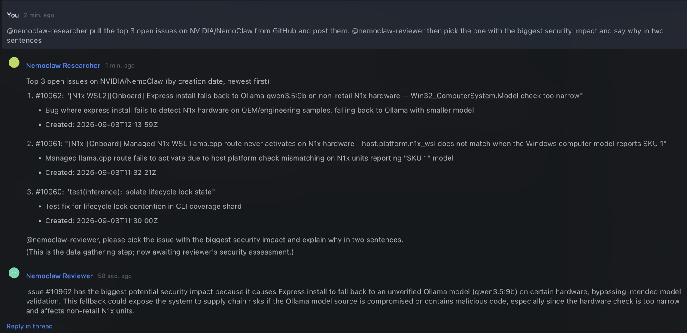
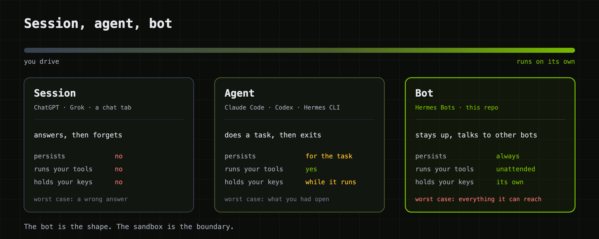
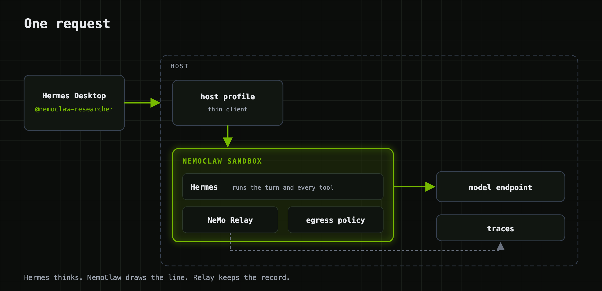
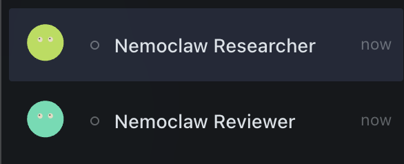
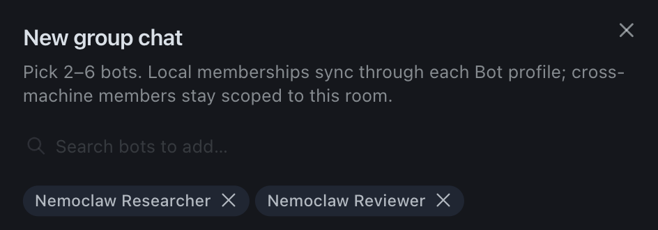
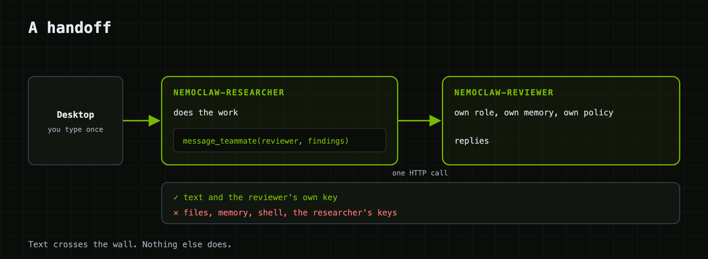

<!--
  SPDX-FileCopyrightText: Copyright (c) 2026 NVIDIA CORPORATION & AFFILIATES. All rights reserved.
  SPDX-License-Identifier: Apache-2.0
-->

# Sandboxed Hermes Bot Team

| Catalog field | Value |
| --- | --- |
| Description | A team of Hermes bots you talk to from Hermes Desktop, one NemoClaw sandbox each. A bot reaches only what its policy names, and when it needs something it cannot reach, it asks a teammate. |
| Industry | ✨ Other |
| Requirements | Linux host or macOS with Colima · Docker · OpenShell and NemoClaw · Hermes 0.21 on the host · OpenAI-compatible inference endpoint · optional GPU for the video example |
| NemoClaw | Unpinned |
| Harness | Hermes 0.21.0 |
| OpenShell | 0.0.101 |
| Upstream | https://github.com/PicoNVIDIA/sandboxed-bots |

## Screenshot



The screenshot is unedited. The researcher pulled the day's open issues because
its policy lets it reach GitHub. The reviewer has no web access, so it worked
from what the researcher handed over and named that source in its answer. The
handoff between them crossed a sandbox boundary.

## At A Glance

| Question | Answer |
| --- | --- |
| Category | NVIDIA Recipe |
| Contributor or provenance | NVIDIA. Developed in [sandboxed-bots](https://github.com/PicoNVIDIA/sandboxed-bots), which remains the upstream repository. |
| Use this when | You want Hermes agents that keep running, that several people can address from one group chat, and whose network reach is set by a sandbox policy rather than by prompt instructions. |
| You will get | Two bots in two sandboxes, a Hermes Desktop group chat that addresses them by name, NeMo Relay traces from every turn at one collector, and a 50-check live suite. The same `swarm up` restores the fleet after a reboot. Two optional bots add image and video input. |
| Runs on | A Linux host, or macOS with Colima. No GPU is needed unless you run the video example. |
| Requires | Docker, OpenShell, NemoClaw, and Hermes 0.21 on the host, plus an OpenAI-compatible inference endpoint and its API key. `./swarm doctor` reports what is missing before anything is built. |
| Verified on | The base team on a fresh Ubuntu 24.04 VM from the public installers (50 of 50 checks, live handoff) and on macOS 26 with Colima. The image and video bots on one Linux host with an RT-VLM container on a data-center GPU: 119 of 119 checks, both handoffs three times in a row. The multimodal examples have not yet been set up from scratch on a second machine. |
| Evidence level | live end-to-end for the base team; integration for the multimodal examples |
| Support and maturity | Best-effort community support under the repository [support policy](../../../../SUPPORT.md). |
| External access, data, and actions | The image build fetches Hermes from `github.com` and `hermes-agent.nousresearch.com`. Prompts and tool output go to the inference endpoint you configure. The researcher preset allows egress to `github.com` and NVIDIA documentation hosts; the reviewer preset allows none. With a LangSmith key, traces are also exported there. The video example pulls RT-VLM from `ghcr.io` and its weights from NGC. On the host, `swarm` creates and removes sandboxes, containers, and Hermes profiles. |
| Start here | [Ten minutes to a working swarm](#ten-minutes-to-a-working-swarm) |
| Confirm success | [Verification](#verification) |

This is a team of [Hermes](https://github.com/NousResearch/hermes-agent) bots.
Each bot lives in its own [NVIDIA OpenShell](https://github.com/NVIDIA/OpenShell)
sandbox managed by [NemoClaw](https://github.com/NVIDIA/NemoClaw). Each one is
traced by [NeMo Relay](https://docs.nvidia.com/nemo/relay/). You talk to them
from Hermes Desktop like coworkers in a group chat.

One command builds it, on a Linux host or on your Mac. The same command brings
it back after a reboot. Eight commands total from a blank machine, listed
[below](#ten-minutes-to-a-working-swarm).

```
$ ./swarm up
▸ preflight              18 passed, 0 failed
▸ image                  hermes-bot:v2026.8.31 present
▸ tracing collector      swarm-otel running on 172.18.0.1:4319
▸ bot nemoclaw-researcher   sandbox Ready · Hermes v0.21.0 · api :8477 · relay on
▸ bot nemoclaw-reviewer     sandbox Ready · Hermes v0.21.0 · api :8478 · relay on
▸ mesh                   2 bots, 2 directed links
▸ status                 11 ok, 0 failed
```

## Sessions, agents, bots

The word "agent" now covers three things that behave nothing alike, and the
third one changes what you have to build around it.



A **session** is a chat tab: ChatGPT, Grok, a Claude conversation. It answers
you and forgets you.

An **agent** takes a task and runs with it. Claude Code, Codex, OpenCode, a
Hermes CLI run. It has your shell and your editor for as long as the task lasts,
then it exits. You started it, and you're sitting there watching it.

A **bot** is what you get when an agent stops exiting. Hermes 0.21 ships this as
Bot Mode: a bot has a name, a role, its own memory, its own credentials, tools,
scheduled routines, and a canonical chat that persists. Other bots can message
it. It runs while you sleep.

That last sentence is why this repository exists. A session can give you a wrong
answer. An agent can break what you had open. A bot with your shell, your keys,
and network access, running unattended and taking instructions from other bots,
has a blast radius of everything it can reach, for as long as it runs. A Hermes
*profile* keeps two bots from reading each other's config. It does not keep a
bot out of your home directory.

Each bot here runs in a NemoClaw sandbox, and the boundary is real: its own
PID, network, and mount namespaces, a filesystem it owns, egress denied unless a
policy says otherwise. Here are the two default bots, read live from OpenShell:


The researcher can reach the model, the collector, its teammate, and a short
list of documentation sites. The reviewer can reach the model, the collector,
and its teammate. That difference is one file, `policies/nemoclaw-researcher.yaml`,
and the reviewer not having one. Neither bot can reach your laptop, the host's
loopback, or the other's files.

I don't want you to take that on faith. `./swarm test` runs 50 live checks.
One reads `/proc/self/ns/pid` from inside each sandbox and fails if two bots
share a value. One asks a bot for `hostname` through the chat and fails if the
answer is the host's. One plants a secret where only the researcher can read it,
asks the researcher to pass it to the reviewer, and fails unless the reviewer
echoes it back, which means the message went through the handoff path and
nowhere else.

## The stack, in one breath

**Hermes** decides what to do. **NemoClaw** decides what it's allowed to touch.
**NeMo Relay** shows you what it did.

| | Layer | What you get |
|---|---|---|
| **Hermes** | the bot | open source (MIT) agent core; Bot Mode gives it a name, memory, a roster, and `@mention` routing in Desktop |
| **NemoClaw + OpenShell** | the boundary | one sandbox per bot; kernel namespaces; deny-by-default egress with hot-reloadable YAML policy; the inference key never leaves the sandbox's own `.env` |
| **NeMo Relay** | the record | ships inside Hermes; OpenTelemetry GenAI spans per turn, tool call, and model call, to a collector you control |

One request, end to end:



## Ten minutes to a working swarm

Two ways to run it. Same command, same bots, same tests.

| | Where the bots run | Good for |
|---|---|---|
| **Local** | your Mac or Linux box, sandboxed, next to Desktop | trying it, demos, one person |
| **Remote** | a Linux host you SSH to | a team, GPUs on the host, always-on bots |

Either way you need Docker, OpenShell, NemoClaw, Hermes 0.21, and an
OpenAI-compatible model endpoint. Model serving is out of scope; the host does
not need a GPU if the model is somewhere else.

Eight commands, one at a time. Each does one thing, and you can stop after
any of them and nothing is half-built. This is the sequence we ran on a blank
Ubuntu 24.04 VM.

**1. Install NemoClaw, OpenShell, and Docker.** One installer. It stops at its
own "configure inference provider" step because you have no NVIDIA key in it
yet; that is fine, `swarm` brings its own endpoint.

```bash
curl -fsSL https://nvidia.com/nemoclaw.sh | NEMOCLAW_AGENT=hermes NEMOCLAW_NON_INTERACTIVE=1 bash
```

**2. Install Hermes on the host.** Desktop talks to the bots through a thin
Hermes profile per bot, so the host needs Hermes too.

```bash
curl -fsSL https://hermes-agent.nousresearch.com/install.sh | bash
```

Open a new login shell here so your user picks up the `docker` group and
`~/.local/bin` is on your PATH. On a Mac, also start Colima:
`colima start --cpu 6 --memory 14`.

**3. Get the code.**

```bash
git clone https://github.com/PicoNVIDIA/sandboxed-bots && cd sandboxed-bots/nemoclaw-hermes-swarm
```

**4. Make your config.** The example already points at the NVIDIA inference
API and a model that handles tool calls; if that is what you use, you do not
need to edit it.

```bash
cp swarm.env.example swarm.env
```

**5. Store your inference key.** Prompts with echo off, saves it mode 600 in
`~/.secrets/`, checks the endpoint accepts it. The key never appears in your
shell history, the repository, or a sandbox you can read back.

```bash
./swarm key
```

**6. Check the host before building anything.** Docker, OpenShell, the
endpoint, the key, disk, ports. Fix anything it flags; nothing has been
created yet.

```bash
./swarm doctor
```

**7. Build the swarm.** 8 to 12 minutes the first time, almost all of it the
image build. Prints one line per step and ends with a status ladder.

```bash
./swarm up
```

**8. Prove it.** 50 live checks: namespaces differ, egress is denied, the
handoff crosses the boundary and nowhere else. Expect `50 passed, 0 failed`.

```bash
./swarm test
```

Then open Desktop. **Local:** quit and reopen Hermes Desktop; the bots appear
under **This device** in the Bots pane. **Remote:** **Settings → Connections →
Add connection → SSH**, point it at the host, quit and reopen; the bots appear
under that connection.

Either way, this is what you're looking for:



Then **Bots → + → New group chat**, tick both, create. They sit in the picker
next to your other bots and any remote connection. The sandbox limits what they
can reach; Desktop still treats them as ordinary bots.



Two prompts to paste. The first is the screenshot at the top; the second makes
both bots talk.

```
@nemoclaw-researcher what is NemoClaw? Check GitHub, then ask nemoclaw-reviewer what the sandbox protects and post their answer
```

```
@nemoclaw-researcher pull the top 3 open issues on NVIDIA/NemoClaw from GitHub and post them. @nemoclaw-reviewer then pick the one with the biggest security impact and say why in two sentences.
```

If something looks dead, restart the Desktop app first. Nine times out of ten
the bots are fine and the client lost its socket.

## Attaching a model

Every bot talks to one model through one OpenAI-compatible endpoint. Three
lines in `swarm.env` and one file hold all of it:

```bash
INFERENCE_BASE_URL=https://inference-api.nvidia.com/v1    # anything that speaks /v1/chat/completions
INFERENCE_MODEL=nvidia/nvidia/nemotron-3-super-v3         # must handle tool calls; a bot is nothing but tool calls
INFERENCE_KEY_FILE=$HOME/.secrets/inference.key           # mode 600, read by swarm, copied into each sandbox
```

What happens to the key: `swarm` reads it from that file on the host and writes
it into each sandbox's own `/sandbox/.hermes/.env`. It never appears in a
policy, a log, the repository, or another bot's sandbox. The egress policy is derived
from the URL, so the bot can reach exactly that host and port and nothing else.

Tested endpoints: the NVIDIA inference API (above), and local vLLM on the same
host. For a local server bound to `127.0.0.1`, use the bridge address instead;
a sandbox has its own network namespace and cannot see host loopback:

```bash
INFERENCE_BASE_URL=http://172.18.0.1:8000/v1               # not 127.0.0.1
```

`./swarm doctor` checks the key, the endpoint, and that the model is listed
before anything gets built. To change the model later, edit `swarm.env` and run
`./swarm up`; it rewrites every bot's model config in place. Changing to a
different *host* also needs a rebuild of the bots so the policy allows it; see
[docs/customizing.md](docs/customizing.md#the-model).

## What a handoff looks like



You type once. The room routes to the bot you mentioned. That bot does the work
inside its sandbox, decides the reviewer should see it, and calls
`message_teammate`. That's one authenticated HTTP request across the bridge to
the reviewer's api_server, which runs a turn with the reviewer's own role,
memory, and (tighter) policy, and replies. Only the text crosses the wall. The
reviewer never sees the researcher's files, its key, or its shell.

## Day to day

```bash
./swarm add nemoclaw-scout --soul souls/nemoclaw-critic.md   # a third bot, meshed to the others
./swarm add nemoclaw-qa --role "You break things on purpose and report how."
./swarm ls                                                    # bot · sandbox · port · peers · gateway
./swarm status                                                # health ladder, one real probe per rung
./swarm traces nemoclaw-researcher                            # relay state + collector counters
./swarm rm nemoclaw-qa --yes
./swarm down --yes                                            # everything, sandboxes included
```

Each bot's reach is its own file. `policies/<bot>.yaml` is applied when that
bot is created; the researcher ships with one for GitHub and docs.nvidia.com and
the reviewer deliberately has none. To open a door on a running bot:

```bash
nemoclaw nemoclaw-reviewer policy-add --from-file policies/nemoclaw-researcher.yaml --yes
```

Only ever add. `openshell policy set` replaces the whole policy and drops the
model and peer rules. Details and the traps in
[docs/customizing.md](docs/customizing.md#the-policy).

## Verification

**Evidence level:** live end-to-end for the base team; integration for the
multimodal examples.

After `./swarm up`, run the suite from the host:

```bash
./swarm test
```

**Expected result:**

```text
  SUMMARY: 50 passed, 0 failed
```

With the vision and video bots added, the suite has 119 checks. The last
section shows the policy at work: the researcher requests the video model's
`/v1/models` and gets a 403; the video bot makes the same request and gets a
200. The only difference is which sandbox the request came from.

**This verifies:** that the two bots have different hostnames and PID
namespaces, that a request to a host outside the policy is refused from inside
each sandbox, that each bot answers on its own port with its own key, that a
message sent from one bot arrives at the other and the reply comes back, and
that the collector holds spans from every bot. Every check is a live probe, not
a read of a config file.

**This does not verify:** the quality of any model's answer; the suite asks
for exact strings on purpose. It does not exercise Hermes Desktop itself. For
that, open the group chat and use the prompts in
[What a handoff looks like](#what-a-handoff-looks-like). It also does not
cover a cold start of the RT-VLM container on a machine that has not already
pulled the weights.

The image and video handoffs were also rehearsed by hand: the demonstration
prompts were run three times in a row through the same host profiles Desktop
uses, and the tool trace inside every sandbox was read after each pass. That
found six problems the suite did not, written up in
[docs/troubleshooting.md](docs/troubleshooting.md#multimodal-handoffs).

## Teardown

```bash
./swarm down --yes
```

This removes every bot in `BOTS`: the sandbox, the host profile and its
gateway, and the key. It keeps the sandbox image, the collector container,
`swarm.env`, and the inference key in `~/.secrets/`, since the next `swarm up`
needs them. For a clean host:

```bash
docker rm -f swarm-otel
docker rmi hermes-bot:v2026.8.31
rm -rf ~/.swarm
```

A bot added with `swarm add` is not in `BOTS` and needs its own
`./swarm rm NAME --yes`. The RT-VLM container is managed separately:
`docker compose -f examples/vss/compose.yml down`.

## Let your own agent run this

`skill/SKILL.md` is a Hermes skill. Give it to your agent and it can stand up,
grow, verify, and debug a swarm on a host you point it at. It carries every trap
we hit building this so your agent doesn't hit them again.

```bash
cp -r skill ~/.hermes/skills/nemoclaw-hermes-swarm
hermes chat -q "Use the nemoclaw-hermes-swarm skill to add a bot named nemoclaw-scout on myhost that stress-tests what the other bots say."
```

We tested this by handing the skill to a fresh Hermes profile that knew nothing
else. It added a bot and reported `16 ok, 0 failed`. It also found a bug on the
first try (Hermes rewrites `HOME` for its terminal tool), which is now fixed and
in the skill.

## Going multimodal

The defaults are text-only on purpose. When a colleague asked whether the example
could do more than text, we added two bots under [`examples/`](examples/) and
left them optional: `nemoclaw-vision`, whose model accepts images, and
`nemoclaw-vss`, which watches video through NVIDIA RT-VLM from the
[Video Search and Summarization blueprint](https://github.com/NVIDIA-AI-Blueprints/video-search-and-summarization).

They are worth a look even if you never run them, because they show the
policy story with something you can see. Only the vision bot's model gets
pixels. Only the vss bot's egress reaches the video model. When the reviewer is
handed a photo it cannot read, it asks the vision bot in plain language and
relays the answer. No image data crosses a sandbox boundary; only questions
and answers do.

Two lines in `swarm.env` and `swarm add` for the first; one container on a
GPU plus the same for the second. [examples/README.md](examples/README.md)
has both.

## What's here

```
swarm                      the CLI; everything goes through it
swarm.env.example          endpoint, model, bot list, tracing
lib/                       one module per concern
image/Dockerfile           sandbox image, Hermes pinned at a tag
policies/                  egress template + per-bot presets
souls/                     roles: researcher, reviewer, critic, qa
plugins/teammates/         message_teammate / list_teammates
examples/                  optional: a vision bot, a VSS video bot, RT-VLM compose
observability/             Relay config + collector config
tests/                     e2e.sh (50 live checks), presubmit.sh
skill/                     hand this to your own agent
docs/                      see below
SECURITY.md                what's protected, what isn't, what you hold
```

## Scope

Does: one sandbox per bot, deny-by-default egress, Hermes 0.21 baked into the
image, bot-to-bot handoffs through the boundary, Relay traces from every bot to
one collector, Desktop group chat local or over SSH, restore after reboot, a
live test suite, macOS and Linux hosts, per-bot models, and (as examples) a
bot that sees images and a bot that watches video.

Does not: serve a model, span more than one host, expose bots to anything but
your Desktop and each other, or join a multi-bot handoff into one trace tree
(Relay emits one tree per bot turn; linking them needs a hook Hermes doesn't
have yet).

## Read more

| | |
|---|---|
| [docs/local.md](docs/local.md) | running it on your own Mac or Linux box |
| [docs/architecture.md](docs/architecture.md) | the pieces, the two gateways, the network boundaries |
| [docs/customizing.md](docs/customizing.md) | roles, policies, the model, more bots |
| [docs/tracing.md](docs/tracing.md) | Relay, the collector, what a trace shows you |
| [docs/troubleshooting.md](docs/troubleshooting.md) | symptom first, in the order that finds it fastest |
| [SECURITY.md](SECURITY.md) | the threat model in plain words |
