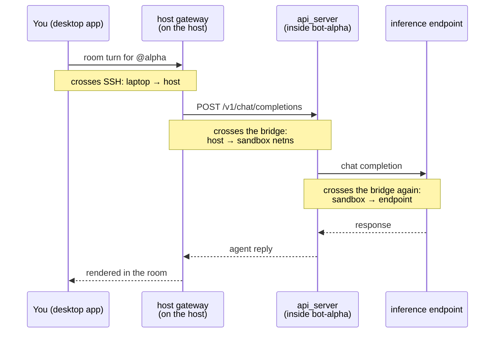
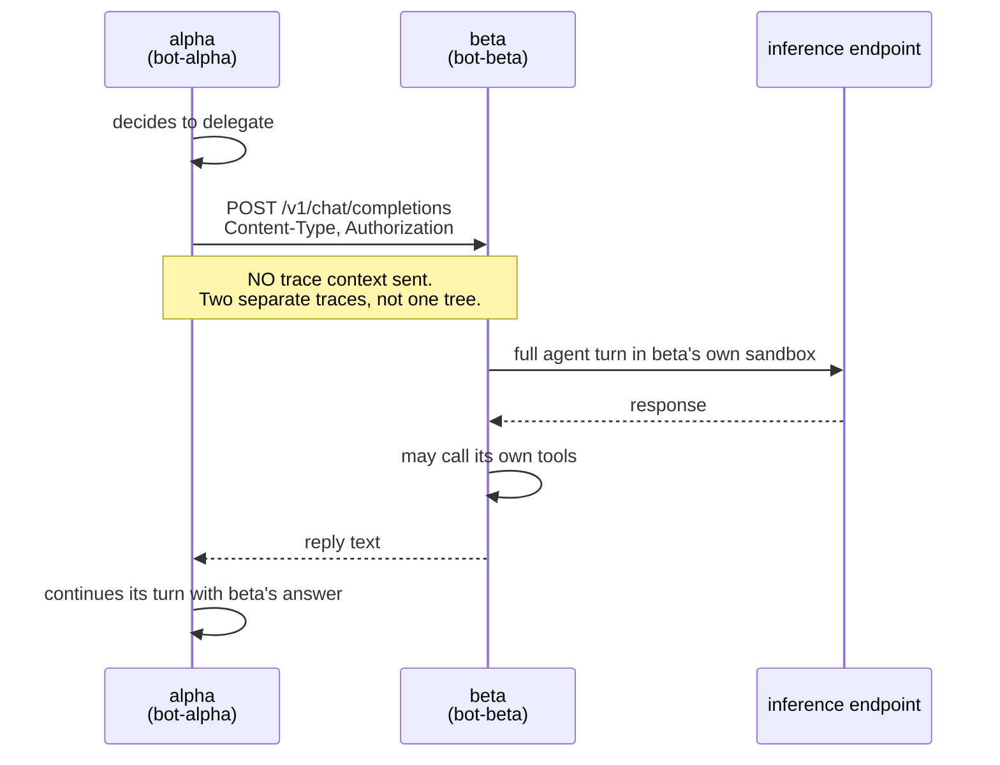
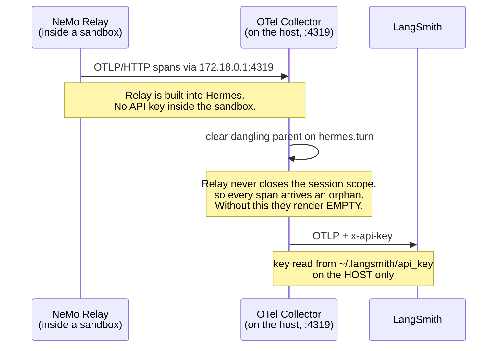

# Architecture

Six diagrams and a table. If you read one thing, read the two-gateway diagram:
conflating those two gateways is the most common way this setup breaks.

## Components

```
  YOUR LAPTOP                        │            THE HOST (Linux + Docker)
                                     │
  ┌───────────────────────┐          │   ┌──────────────────────────────────────┐
  │ Hermes desktop app    │   SSH    │   │ host gateway per agent               │
  │  Bots roster          │──────────┼──▶│   hermes -p <agent> gateway run      │
  │  group chat           │          │   └───────────────┬──────────────────────┘
  └───────────────────────┘          │                   │ model.base_url
                                     │                   ▼
                                     │   OpenShell bridge  172.18.0.1
                                     │   ┌───────┬───────┬───────┬───────┐
                                     │   │ :8477 │ :8478 │ :8479 │ :8480 │
                                     │   └───┬───┴───┬───┴───┬───┴───┬───┘
                                     │       │       │       │       │
                                     │   ┌───▼───┐┌──▼────┐┌─▼─────┐┌▼──────┐
                                     │   │bot-   ││bot-   ││bot-   ││bot-   │
                                     │   │alpha  ││beta   ││gamma  ││delta  │
                                     │   │       ││       ││       ││       │
                                     │   │Hermes ││Hermes ││Hermes ││Hermes │
                                     │   │+ api_ ││+ api_ ││+ api_ ││+ api_ │
                                     │   │server ││server ││server ││server │
                                     │   └───┬───┘└──┬────┘└─┬─────┘└┬──────┘
                                     │       └───────┴───┬───┴───────┘
                                     │                   ▼
                                     │   ┌──────────────────────────────────────┐
                                     │   │ inference endpoint (OpenAI-compatible)│
                                     │   │ vLLM / SGLang / NIM / hosted API      │
                                     │   │ shared by every agent                 │
                                     │   └──────────────────────────────────────┘
```

Each sandbox is a separate container with its own PID, network, mount, and IPC
namespaces. Agents cannot see each other's processes or files.

## Two gateways per agent

Every agent runs two gateway processes. They do different jobs, and missing the
second one produces an agent that works perfectly over HTTP yet never appears in
the desktop.

```
                    ┌─────────────────────────────────────────┐
                    │ HOST                                    │
                    │                                         │
   desktop ────────▶│  host gateway                           │
   Bots roster      │  hermes -p alpha gateway run            │
   enumerates       │                                         │
   THIS one         │  • makes `hermes profile list` say       │
                    │    "running"                            │
                    │  • the ONLY thing the roster sees       │
                    │  • writes gateway.pid / .lock / .sock   │
                    │                                         │
                    │            │ model.base_url             │
                    │            │ 172.18.0.1:8477            │
                    └────────────┼────────────────────────────┘
                                 ▼
                    ┌─────────────────────────────────────────┐
                    │ SANDBOX bot-alpha                       │
                    │                                         │
                    │  in-sandbox gateway                     │
                    │  • serves the api_server on :8477       │
                    │  • runs the actual agent turns          │
                    │  • answers `message_teammate` calls     │
                    └─────────────────────────────────────────┘
```

| you have | symptom |
|---|---|
| both | works everywhere |
| in-sandbox only | api_server returns 200, `hermes -p X chat` works, **absent from the roster** |
| host only | appears in the roster, every request fails |

Check with `ls ~/.hermes/profiles/<agent>/ | grep gateway`. A healthy agent has
`gateway.pid` and `gateway.lock`. `gateway.sock` and `gateway_state.json` are
version/transport dependent and may be absent on a healthy profile. The
authoritative check is `hermes profile list` reporting `running`.

## One message in group chat



Three network boundaries per turn. Each is a place a deny-by-default policy can
stop you, and each returns a different status code (see the table below).

## Agent-to-agent handoff



The teammate runs a **complete agent turn**, with its own tools, its own sandbox,
and its own policy. It is not a function call.

Because no `traceparent` is propagated, a handoff shows up as two disconnected
traces. Linking them would need a change on both the sender and the receiver.

## Tracing (optional)



The collector exists so the API key never enters an agent-writable filesystem.

## Network boundaries

`127.0.0.1` means something different in each context. This is the single most
common source of confusion.

| where you are | `127.0.0.1` means | to reach the host use | to reach a sandbox use |
|---|---|---|---|
| your laptop | your laptop | SSH to the host | via the host |
| the host | the host | `127.0.0.1` | `172.18.0.1:<port>` |
| inside a sandbox | **that sandbox** | `host.openshell.internal` | `host.openshell.internal:<port>` |

`host.openshell.internal` resolves only inside a sandbox. Probing that name from
the host always fails.

Status codes tell you which layer refused:

| code | meaning |
|---|---|
| 403 | policy denied it: host not allowed, or the calling binary is not listed |
| 502 | policy allowed it, nothing is listening |
| 401 | you reached the target, the credential is wrong |
| 000 | no route at all |
| 200 | working |
