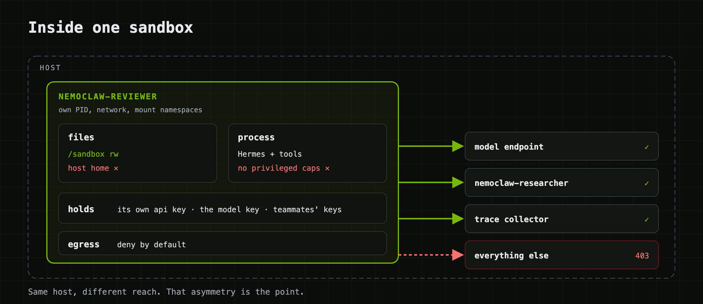

# Architecture

If you read one thing here, read [the two gateways](#the-two-gateways). Mixing
them up is how this setup breaks most often, and the symptom (a bot that answers
over HTTP but is invisible in Desktop) looks like anything but a gateway problem.

## One request

<p align="center"></p>

You type `@nemoclaw-researcher …` in a Desktop room. Desktop is connected to the
host over SSH. On the host there's a thin Hermes profile for each bot whose only
job is to point at the bot's sandbox. It posts your message to the sandbox's
api_server across the OpenShell bridge. Inside the sandbox, the real Hermes
runs the turn: reads its SOUL, calls the model, runs tools, maybe messages a
teammate. Relay, in the same process, emits a span for each of those and ships
them to a collector on the host. The reply comes back the way it went in.

Every tool the bot runs executes inside the sandbox under that sandbox's egress
policy. `./swarm test` checks this the blunt way: it asks a bot to run
`hostname` and fails if the answer is the host's name.

## Inside a sandbox

<p align="center"></p>

An OpenShell sandbox is a container with its own PID, network, mount, and IPC
namespaces, a Landlock-restricted filesystem, and an egress proxy that denies
everything not on the list. The list starts with one entry (your model endpoint)
and grows only through additive presets that `swarm` applies:

| Preset | Who gets it | Lets the bot reach |
|---|---|---|
| `otlp-export` | every bot when `TRACING=on` | the collector on the bridge |
| `peer-<name>` | both sides of every pair | that teammate's api_server port |
| `policies/<bot>.yaml` | only a bot with a file by that name | whatever you put there |

The researcher ships with `policies/nemoclaw-researcher.yaml` (GitHub,
docs.nvidia.com). The reviewer has no such file. Two bots on the same host with
different reach is the whole idea.

## The two gateways

Every bot runs two Hermes gateway processes with different jobs.

```
                 ┌──────────────────────────────────────────────────────┐
                 │ HOST                                                 │
  Desktop ──────▶│  host gateway   hermes -p nemoclaw-researcher gateway run
  Bots roster    │    makes `hermes profile list` say "running"         │
  lists THIS     │    the only thing the roster sees                    │
                 │    model.base_url = http://172.18.0.1:8477/v1        │
                 │                            │                         │
                 │  bridge forward            │ openshell forward       │
                 │  172.18.0.1:8477 ──────────┼──▶ nemoclaw-researcher:8477
                 └────────────────────────────┼─────────────────────────┘
                                              │
                 ┌────────────────────────────▼─────────────────────────┐
                 │ SANDBOX nemoclaw-researcher                          │
                 │  in-sandbox gateway   hermes gateway run             │
                 │    serves the api_server on :8477                    │
                 │    runs the agent loop and every tool call           │
                 │    reads SOUL.md, bot_peers, relay config            │
                 └──────────────────────────────────────────────────────┘
```

The host profile is a shim. Its `model.base_url` is the sandbox's api_server,
so a "model call" from the host profile is a full agent turn inside the sandbox.
That one trick is what makes `hermes -p nemoclaw-researcher chat` and a Desktop
`@nemoclaw-researcher` both execute in the sandbox rather than on the host.

| You see | It means |
|---|---|
| api_server 200, `hermes -p X chat` works, X missing from the roster | host gateway is down; `./swarm up` restarts it |
| `hermes profile list` says running, chat hangs | in-sandbox gateway or model endpoint is down; `./swarm status` |
| both fine, Desktop room dead | Desktop's backend is stale; restart the app |

## A handoff

<p align="center"></p>

Three things let a message cross from one sandbox to another, and `./swarm add`
sets up all three, both directions, for every pair:

1. a peer entry inside the sender's sandbox (`hermes peer add nemoclaw-reviewer
   --url http://host.openshell.internal:8478 --key …`), because the agent loop
   runs in there and that's the config it reads
2. an additive egress rule in the sender's policy for the receiver's port
3. the `teammates` plugin, which turns "message the reviewer" into a real tool
   call with the target checked against the peer list

Hermes 0.21 has a built-in `message_agent` that does the same job for bots
Desktop manages. The plugin keeps handoffs working from the CLI and in rooms
with no Desktop attached.

## Tracing

<p align="center"></p>

Relay is part of Hermes; there's nothing to install. `./swarm up` writes one
`relay-plugins.toml` per bot, points Hermes at it, allows egress to the
collector, and restarts the gateway. The collector holds any downstream keys.
Sandboxes never see them. [tracing.md](tracing.md) has the details and the two
gotchas that cost us an afternoon.

## Network boundaries

| From | To | Allowed | How |
|---|---|---|---|
| sandbox | inference endpoint | yes | base policy group `inference` |
| sandbox | collector `172.18.0.1:4319` | yes | preset `otlp-export` |
| sandbox | another bot's api_server | per pair | preset `peer-<name>` |
| sandbox | GitHub, docs sites | only if `policies/<bot>.yaml` says so | per-bot preset |
| sandbox | host loopback `127.0.0.1` | no | different network namespace |
| sandbox | anything else | no | deny by default; HTTPS gets `CONNECT … 403` |
| sandbox | another sandbox's filesystem | no | separate mount namespace |
| host | sandbox api_server | with that bot's key | bridge forward + `API_SERVER_KEY` |
| Desktop | host | SSH | a Hermes Desktop connection |
| Desktop | sandbox | never directly | always through the host profile |

## Where things live

| | Host | Sandbox |
|---|---|---|
| SOUL, config, sessions, memory | `~/.hermes/profiles/<bot>/` (shim) | `/sandbox/.hermes/` (real) |
| the bot's api_server key | `~/.swarm/keys/<bot>.key`, mode 600 | `/sandbox/.hermes/.env` |
| inference key | `~/.secrets/inference.key`, mode 600 | `/sandbox/.hermes/.env` |
| rendered policies | `~/.swarm/policies/` | applied to the sandbox |
| relay config | `~/.swarm/relay/<bot>.relay-plugins.toml` | `/sandbox/.hermes/relay-plugins.toml` |
| logs | `~/.swarm/logs/<bot>-{gateway,forward,host-gateway}.log` | `/sandbox/.hermes/logs/` |
| LangSmith key (optional) | `~/.langsmith/api_key`, mode 600, collector env only | never |
