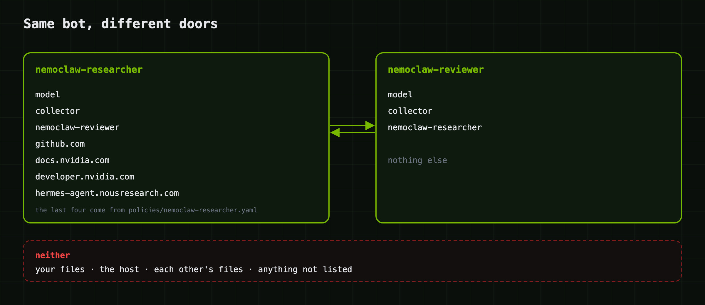

# Customizing

Three things make a bot what it is, and you can change each one on its own.

| What | Where | Changes |
|---|---|---|
| role (SOUL) | `souls/<bot>.md` | how it thinks, what it refuses, how it writes |
| policy | `policies/bot.template.yaml` + `policies/<bot>.yaml` | what it can reach on the network and disk |
| model | `swarm.env` | which endpoint, which model, how much context |

Start with the role. Most of what makes a bot useful lives there, and changing
it costs nothing.

## The role

A soul is a markdown file that becomes the bot's system prompt. `./swarm add`
copies it to `/sandbox/.hermes/SOUL.md` inside the sandbox and appends two short
sections of its own: a Runtime note (you're a NemoClaw bot in sandbox X, here's
what you can reach) and a Teammates note (how to hand work to another bot).

```bash
./swarm add nemoclaw-auditor --soul ./souls/nemoclaw-reviewer.md
./swarm add nemoclaw-auditor --role "You audit Terraform for security problems."
```

Roles are identity, not hot config. To change a running bot's role: `./swarm rm`
it, edit the file, `./swarm add` it again.

### What makes a role work

I've watched a lot of these fail. The ones that work share a few habits.

Give it a method, not a job title. "You are a researcher" gets you generic output.
A numbered procedure gets you the same shape of answer every time. Look at
`souls/nemoclaw-researcher.md`: plan, research, try to disprove yourself, then
write.

Aim each rule at a failure you saw. Every line below exists because a bot did
the opposite in front of us:

```markdown
## Hard rules
- Never invent a source, citation, URL, number, or quote.
- Never cite an issue or PR you did not fetch in THIS session. Recalling an
  identifier from memory is fabrication even when it happens to exist.
- Say what you found, what you inferred, and what you assumed, using those words.
- If a tool cannot reach what you need, name the blocker. A blocked source is a
  finding, not a thing to route around.
```

The second one matters more than it looks. A bot with web access will produce
plausible GitHub issue numbers from training data, with confidence, unless told
not to. One of ours reported nine issues as open. Four were closed. Zero tool
calls that turn.

Make it answer now. Nothing re-prompts a bot. "I'll look into that and report back"
is a dead end for whoever asked.

```markdown
Deliver a usable answer in THE SAME MESSAGE. Never ask the user to scope the
task and never promise to report back later.
```

Cap the retries. A bot that hits a policy denial and tries three workarounds
burns six minutes and ships nothing. This paragraph turned that into a 57 second
answer with ten cited sources:

```markdown
If a source is unreachable, report what you have and name the blocker in one
line. Three failed attempts with the same tool means the path is closed.
```

## The policy

<p align="center">
  
</p>

Every bot starts from `policies/bot.template.yaml`: a read-only system, a
writable `/sandbox`, and exactly one network destination, your model endpoint.
Everything else is denied. `swarm` then adds presets:

| Preset | Applied to | Allows |
|---|---|---|
| `otlp-export` | every bot, when `TRACING=on` | the collector on the bridge |
| `peer-<name>` | both sides of each pair | that teammate's api_server port |
| `policies/<bot>.yaml` | a bot with a file by that name | whatever you list |

That last row is how you give one bot more reach than another. The researcher
ships with `policies/nemoclaw-researcher.yaml`:

```yaml
preset:
  name: web-research
  description: Read public docs and source on GitHub and docs.nvidia.com
network_policies:
  web-research:
    name: web-research
    endpoints:
      - { host: github.com, port: 443, tls: skip }
      - { host: raw.githubusercontent.com, port: 443, tls: skip }
      - { host: docs.nvidia.com, port: 443, tls: skip }
    binaries:
      - { path: /sandbox/.hermes/hermes-agent/venv/bin/python }
      - { path: /usr/bin/curl }
```

Copy it to `policies/nemoclaw-reviewer.yaml` and the reviewer gets the same
reach on its next `add`. Or apply one by hand to a running bot:

```bash
nemoclaw nemoclaw-reviewer policy-add --from-file policies/nemoclaw-researcher.yaml --yes
```

Things that trip everyone the first time:

- `openshell policy set` replaces the whole policy and silently drops the model
  and peer rules. Only ever add.
- A preset needs `preset.name` and must not have a top-level `version`. The
  template used at sandbox creation has `version: 3`; presets don't.
- A rule is host plus binary. Allow `github.com` and forget to list `python`,
  and `curl` gets 200 while the bot's own tool gets 403.
- Each redirect is its own decision. `curl -L https://astral.sh` fails with
  `astral.sh` allowed, because the 301 lands on `releases.astral.sh`.
- The file has to end in `.yaml`.

Reading the status code from inside a sandbox: 403 is policy. 502 is
allowed-but-nothing-listening, usually a service bound to the host's loopback,
which a sandbox can't see. 000 with `CONNECT tunnel failed, response 403` on
stderr is policy denying HTTPS.

## The model

Every bot shares one endpoint and model from `swarm.env`:

```bash
INFERENCE_BASE_URL=https://your-endpoint/v1
INFERENCE_MODEL=your/model-id
INFERENCE_CONTEXT_LENGTH=131072
INFERENCE_MAX_TOKENS=8192
```

The key is read from `INFERENCE_KEY_FILE` (default `~/.secrets/inference.key`,
mode 600) and written into each sandbox's `.env`. It never appears in a policy,
a log, or this repository.

Anything OpenAI-compatible works: NVIDIA NIM, a hosted API, vLLM, SGLang. We
verified against a hosted Nemotron 3 Super endpoint. Two things to check when
you switch: the model has to be good at tool calls (a bot is nothing but tool
calls), and `INFERENCE_CONTEXT_LENGTH` can't exceed what the server actually
serves or the first long turn gets a 400.

To switch models or endpoints, edit `swarm.env` and run `./swarm up`. It
rewrites the model config in every sandbox and restarts the gateways; the
sandboxes, souls, and peers stay. One thing to watch: if the new endpoint is a
different host, the egress policy still only allows the old one. Rebuild those
bots (`./swarm rm`, `./swarm add`) so the policy is rendered for the new URL.

There's deliberately no per-bot model knob. A fleet on one model is a fleet you
can reason about, and `./swarm up` would overwrite a hand edit anyway.

## More bots

```bash
./swarm add nemoclaw-scout --soul souls/nemoclaw-critic.md
./swarm add nemoclaw-qa --soul souls/nemoclaw-qa.md
```

Each `add` takes 3 to 4 minutes and meshes the new bot with every existing one,
both directions. No model loads; bots share the endpoint. Per-sandbox memory and
CPU are `SANDBOX_MEMORY` and `SANDBOX_CPU` in `swarm.env`.

To make a bot part of the default fleet on a fresh host, add its name to `BOTS`
and drop a `souls/<bot>.md` in place.

## Hermes inside the sandbox

Hermes is baked into the image at the tag in `HERMES_REF`. To move the fleet to
a new release: change `HERMES_REF`, `./swarm down --yes`, `./swarm up`. Don't
`hermes update` inside a sandbox. The image is the source of truth, and a fleet
on mixed versions is miserable to debug.

Skills and plugins for a bot go in `/sandbox/.hermes/skills/` and
`/sandbox/.hermes/plugins/` inside its sandbox. `teammates` is the only plugin
`swarm` installs.
