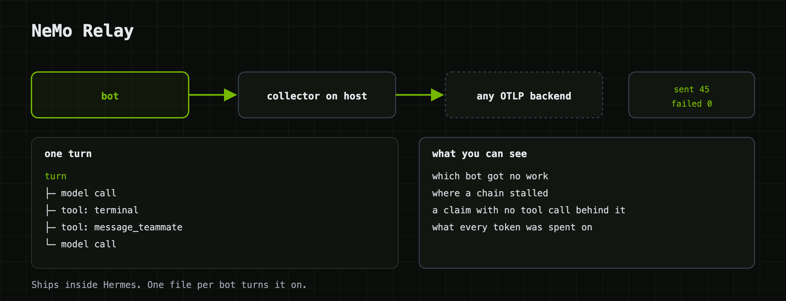

# Tracing with NeMo Relay

A bot that runs unattended needs a record you can read afterwards. NeMo Relay
gives you one: a span for every turn, every model call, every tool call, with
inputs, outputs and token counts, tagged by bot. Relay ships inside Hermes, so
this is a config file per bot and nothing to install. `./swarm up` turns it on.

<p align="center"></p>

## What a trace catches

Four things went wrong while we built this, and a trace exposes each one in
about a second:

| What happened | What the trace shows |
|---|---|
| one bot quietly got no work while the others answered | no `hermes.turn` for it that round |
| a chained task deadlocked | a turn that closes with zero `tool.call` children |
| a bot "verified" sources it had made up | a confident turn with no tool spans under it |
| a bot said `(pass)` and I couldn't tell if it was broken | a completed turn with short output, so it was fine |

The third one took me an hour to catch by hand. I'm not doing that again.

## How it's wired

The collector is the point, not an accessory. It runs on the host and holds any
downstream key (LangSmith, Phoenix, whatever). A sandbox is writable by the bot
inside it, so a credential in a sandbox belongs to that bot. Relay in the sandbox
posts spans to the collector over the bridge; the collector forwards them.

For each bot, `swarm up` and `swarm add`:

1. render `observability/relay-plugins.toml.tmpl` with the bot's name and the
   collector port, and copy it to `/sandbox/.hermes/relay-plugins.toml`
2. set `HERMES_NEMO_RELAY_PLUGINS_TOML` to that path in `/sandbox/.hermes/.env`
3. apply `policies/otlp-export.yaml` so the bot may reach the collector
4. restart the in-sandbox gateway, because the variable is read once at start

Once per host it starts the collector from
`observability/otel-collector-config.yaml.tmpl`. If `LANGSMITH_KEY_FILE`
(default `~/.langsmith/api_key`) exists, spans also go to LangSmith under
`LANGSMITH_PROJECT`. If not, they go to the collector's debug log and counters,
which is enough to prove the pipeline works.

`TRACING=off` in `swarm.env` turns the whole thing off.

## Checking it works

```bash
./swarm traces nemoclaw-researcher
```

prints the bot's relay state (config present, env set, activation line in its
`agent.log`) and the collector's counters. The counters are the only signal I
trust:

```
otelcol_receiver_accepted_spans   45
otelcol_exporter_sent_spans       45     per exporter
otelcol_exporter_send_failed       0
```

`./swarm test` sends a real turn and fails unless `sent` goes up.

## Three things that each cost an afternoon

Relay fails open. A missing or malformed `relay-plugins.toml` logs one
warning and carries on with tracing off. You get a perfectly healthy bot that
exports nothing. Never assume it activated; read the counters.

The environment variable is read once, at process start. Write the TOML or the variable
while the gateway is running and nothing happens. `swarm` restarts the gateway
every time it touches either.

The activation line lands in `agent.log`, not `gateway.log`. Relay logs
`Relay plugins are active process-wide` at INFO through Hermes' own logger, which
writes `/sandbox/.hermes/logs/agent.log` inside the sandbox. It's not in the
stderr you capture on the host, and it's not in `gateway.log`. I spent a while
grepping the wrong file.

## The bug that makes LangSmith runs render empty

You'll know it when you see it: LangSmith shows a run count, every run opens
blank, and `last_run_start_time` never moves.

Relay exports a span when its scope closes. A gateway session stays open for
days, so the outer `hermes.session` scope never closes and never exports. Every
span that does arrive names a parent LangSmith never received. LangSmith accepts
them, counts them, and can't draw them.

The `transform/root` processor in the collector template clears the dangling
parent on `hermes.turn` and `hermes.task_run`, so each turn becomes a real root.
One detail: it has to be the sixteen-zero form. `set(parent_span_id.string, "")`
passes validation and does nothing.

## What a trace looks like

```
hermes.turn                                agent.name=nemoclaw-researcher
└── hermes.task_run
    ├── hermes.logical_llm_call
    │   └── chat nemotron-3-super          gen_ai.usage.input_tokens=3372 …
    ├── tool.call terminal                 hostname
    ├── tool.call message_teammate         → nemoclaw-reviewer
    └── hermes.logical_llm_call            finish_reason=stop
```

Attributes follow the OpenTelemetry GenAI conventions (`gen_ai.request.model`,
`gen_ai.input.messages`, `gen_ai.output.messages`, `gen_ai.usage.*`), plus
`agent.name` as a resource attribute so you can filter by bot.

## One tree per bot, not per handoff

A `message_teammate` handoff shows up as two traces: the researcher's turn, and
separately the reviewer's turn it caused. The plugin sends `Content-Type` and
`Authorization` and nothing else, so no causal context crosses the wall.

Relay has the API to link them; I tested `capture_propagation_context` inside a
sandbox and it works. The sender side is a small plugin change. The receiver side
means the api_server in Hermes core reading a header and seeding the scope, and a
patch there gets overwritten by the next `hermes update`. So it's not done here.
If Hermes grows a hook for it, this example will use it.

## Other backends

The collector speaks OTLP, so point `exporters` at anything that accepts it. For
Arize Phoenix, set `type = "openinference"` in the relay template instead of
`gen_ai`. For debugging Relay itself, `type = "full"` emits every `nemo_relay.*`
attribute. Two endpoints of different types can't share an endpoint and
transport; Relay derives span IDs deterministically and refuses the collision.
